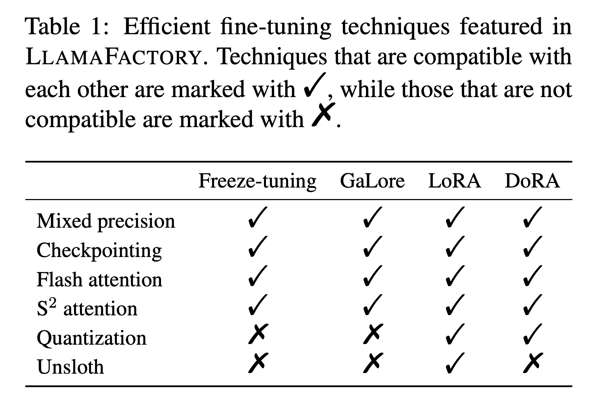
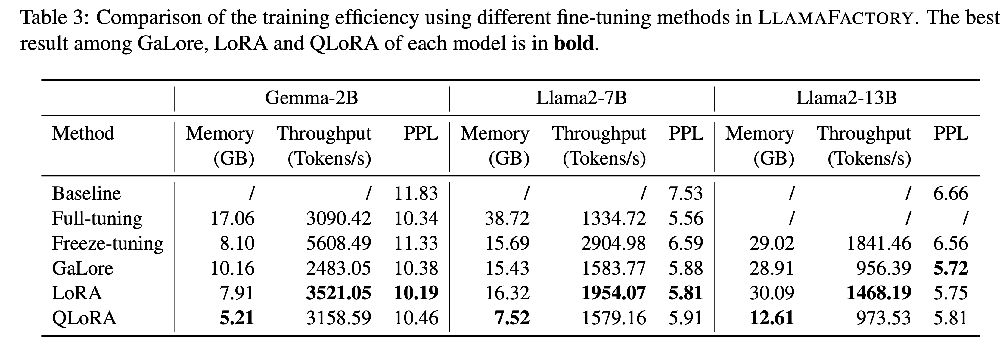
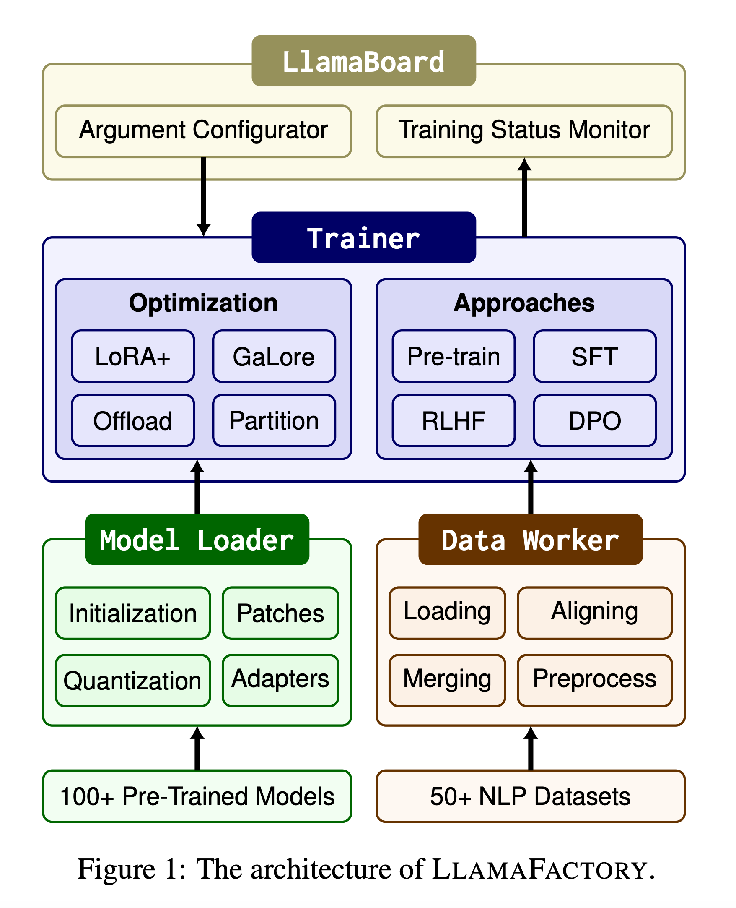
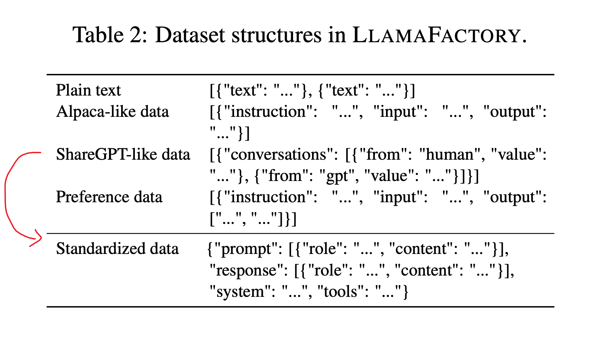
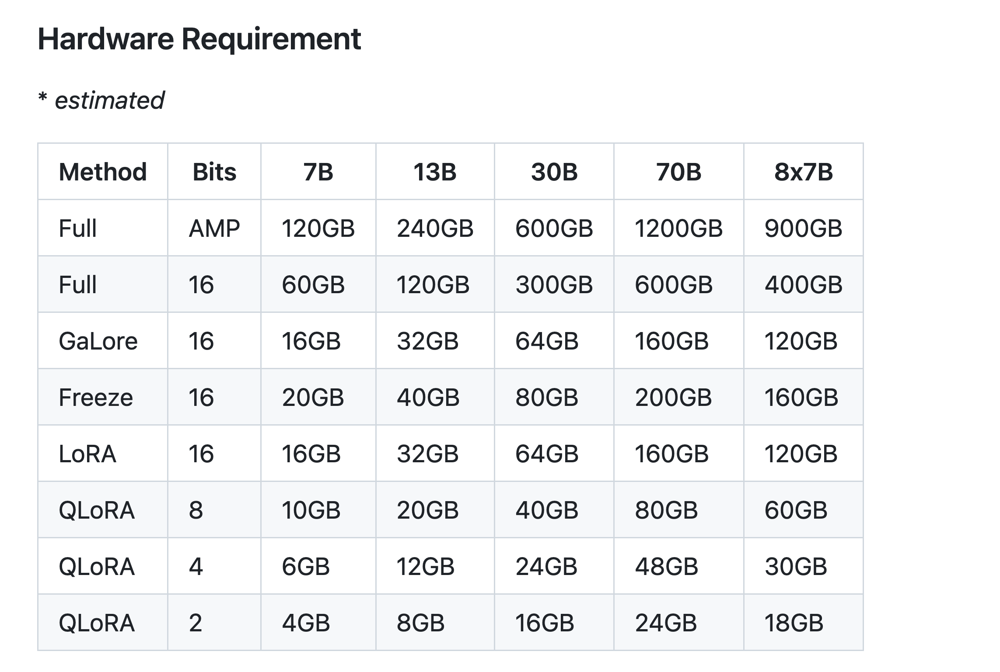
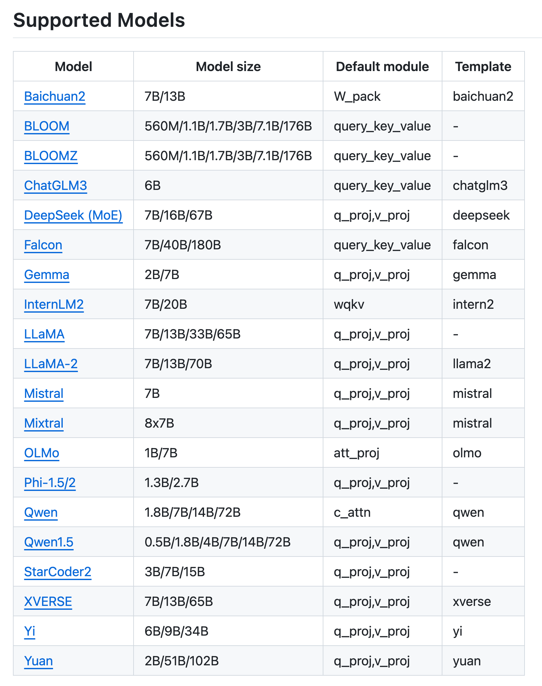

# 2024年LLMs训练的最佳实践

**LLAMAFACTORY: Unified Efficient Fine-Tuning of 100+ Language Models**是一篇LLMs工程好文，来自[LLaMA-Factory](https://github.com/hiyouga/LLaMA-Factory)开源团队。该文从工程的角度对最近的模型高效微调技术做了系统性的整理和对比，同时就模型微调过程中的数据处理、模型参数初始化、训练设置和评估细节都做了比较全面的介绍，如果你整准备训练一个大语言模型，先看看这篇文章会少走很多弯路。

## 模型高效微调

论文首先介绍了**LlamaFactory**库集成的高效微调方法及其相互兼容性。从训练策略划分：

- Freeze-tuning，采用冻结部分参数降低显存开销，提升训练速度
- GaLore，2024年提出的新方法，通过将梯度投影到低秩空间，降低模型全参数更新的显存站用
- LoRA，2022年提出的经典方案，冻结模型权重，训练与模型绑定的低秩矩阵，LoRA加上量化即为QLoRA
- DoRA，2024年提出的新方法，将原始权重分解为幅度与方向分量，利用LoRA训练方向分量部分

训练过程的高效技巧包括：
- Mixed precision，混合精度训练，降低显存开销
- Checkpointing，梯度检查点，降低显存开销
- Flash Attention，2022年提出，高效Attention计算方案
- $S^2$ Attention，2024年提出降低模型在长上线文显存站用
- Quantization，data-free的量化方法LLM.int8, 4-bit，post-training量化方法：GPTQ，AWQ等
- Unsloth，2023年提出，引入Triton降低LoRA梯度方向传播的计算开销

**LlamaFactory**对比了多种模型fine-tuning方法在显存开销，训练速度，训练效果。下表中Memory为训练显存最高占用，Throughput为训练Tokens吞吐量，PPL（perplexity）为模型在训练数据集混淆度，越低越好。观察可发现**LoRA**, **QLoRA**在显存开销和PPL（训练效率）表现很好，吞吐量略逊于Freeze-tuning冻结部分参数微调。

对6个LLMs在3个下游任务fine-tuning对比中，**QLoRA**方法在绝大多数情况下均取得很好的效果，较baseline有了显著提升，说明了fine-tuning对下游任务的有效性，同时作者发现在英文数据集**Mistral 7B**取得最近，中文数据集**Qwen1.5-7B**取得最佳，说明微调后的模型性能很大程度上依然依赖基座模型的固有能力和语言偏好。

## LlamaFactory工程框架

### Model Loader

- Transfoerms AutoModel API
- embedding layer / LM head 自动匹配词表大小
- 支持Flash Attention & $S^2 Attention$加速
- MoE模块支持
- 多种量化策略支持nf4, 4bit, 8bit, GPTQ, AWQ等
- 采用Unsloth加速Lora
- Nvidia GPU / Ascend NPU / AMD GPU

### Dota Worker

- 采用datasets进行数据加载/处理
- 支持超大数据集的流式加载
- 采用标准数据格式对多种类型数据源进行统一
- 内置多种ChatML支持
- 默认只计算模型回复部分loss
- 利用sequence packing加速训练

### 高效训练
- 采用Transformers Trainer进行预训练和监督微调
- 采用TRL库进行RLHF和PPO
- 为了匹配不同的Trainer数据要求，每个batch的2n个样本中，前n样本为选择样本，后n个样本为拒绝样本
- RLHF过程中共享主模型，通过加载adapter来区分policy / value / reference / reward模型，大幅度降低RLHF显存开销
- 采用DeepSpeed支持分布式训练

### 工具
- 采用vLLM/Transformers库作为推理后端，提供OpenAI-style调用
- 内置MMLU/CMMLU/C-eval等多选及BLEU-4/ROUGE相似度等模型评估方法

### LlamaBoard

基于图形界面的模型微调网页前端，配置模型训练数据/参数，监控模型训练，评估模型训练性能，支持中文/英文/俄文界面。

不同训练方法/模型的硬件要求：

支持Baichuan2, ChatGLM3, Yi, Qwen等中文主流模型及 Llama / Mistral / Mixtral-8x7b等英文模型。

